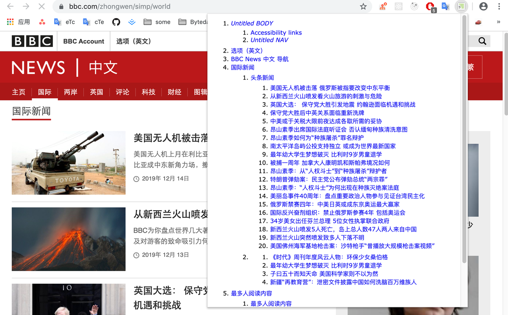
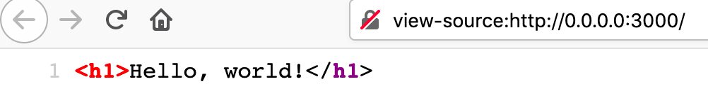
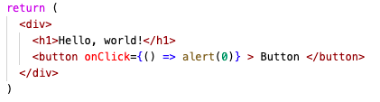
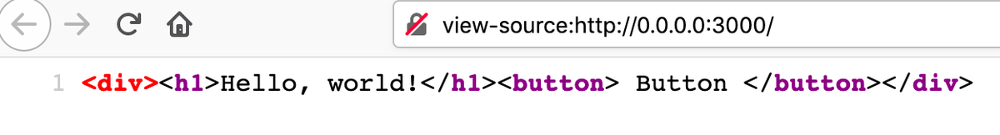
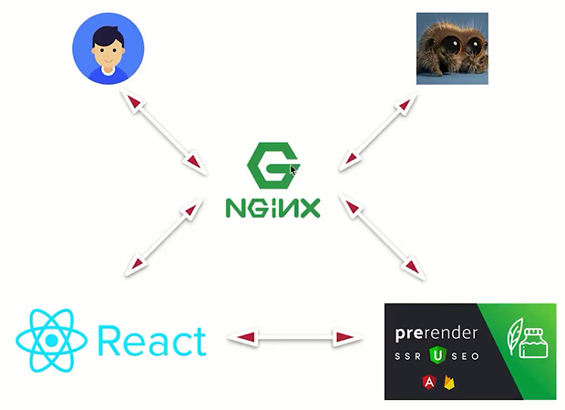
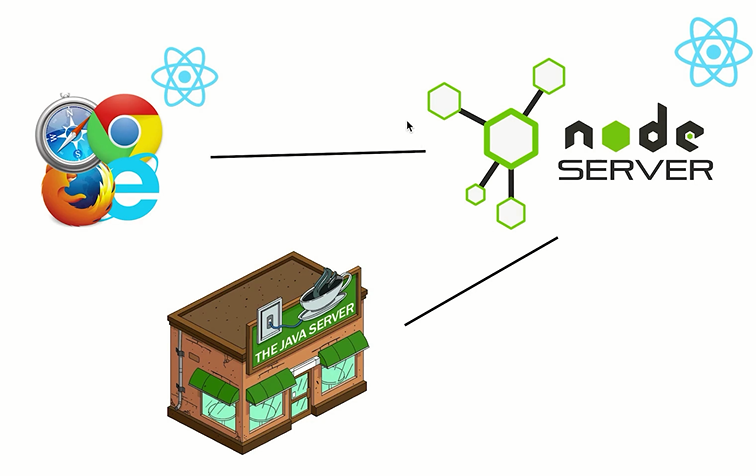

# react-ssr
react服务端渲染

本 README 主要讲解 React 服务端渲染的原理，即从 0 开始构建一个 SSR应用会碰到哪些问题。

## 为什么需要服务端渲染
### 客户端渲染
客户端渲染即普通的 React 项目渲染方式。React 页面中的 DOM 都是使用 JS 动态挂载上去的，页面加载晚了 body 中只有一个 id=root 元素，其他一切都是 React 动态挂载上去的。

#### 渲染流程
1. 浏览器发送请求
2. 服务器返回 HTML
3. 浏览器发送 bundle.js 请求
4. 服务器返回 bundle.js
5. 浏览器执行 bundle.js 中的React代码

#### 带来的问题
1. 首屏加载时间略长
2. SEO 不友好
  
### 什么是SEO？
SEO(Search engin optimization) 搜索引擎优化。指通过一些手段，让网站在搜索引擎搜索时排名更加靠前。
搜索引擎在爬取页面内容时，绝大多数搜索引擎是不认识JS渲染出来的内容的，它只查看返回的html中的内容，就相当于「查看页面源代码」。  

假设网站是客户端渲染出来的，查看源代码就会看见只有一个 id=root 的根元素，搜素引擎就不知道页面的内容，导致在搜索页排名低。

#### 如何做好 SEO？
页面基本由三个部分组成： 文字、链接、多媒体（图像视频等）
- 写语意化的代码来让搜索引擎更好的
  - 定制好title和meta description也可以提高排名
  - [HTML5 Outliner](https://chrome.google.com/webstore/detail/html5-outliner/afoibpobokebhgfnknfndkgemglggomo?hl=en)，可查看DOM 大纲，新闻网页的大纲都是很清晰的。
  
- 内部链接的相关性。
  - 一个网站上的内容与他链接网站的内容要尽量相关，相关度越强，链接的价值就越大。而一个网站有很多都外链到了这个网站，说明了这个网站的影响力是很大的。 比如一个网站是做教育的，但是链接网站很多广告是游戏、体育的，那么说明这个网站多半也不靠谱。
- 多媒体优化。
  - 现在有的搜索引擎可以做图像的识别了，比如谷歌。如果一个网站上的图片能做到原创和高清，那么搜索引擎回认为这个网站更丰富一些。
- 外部链接的数量
  - 有很多链接都指向你，那说明你网站有价值。不过这是内容的事情，没办法用代码优化。
- 文字的原创性。
  - 如果一篇文章是原创的，那么他的价值一定超过转载和抄袭的文章。所以搜索引擎在搜索时会把原创（文章内容最早被检索记录）当作一个重要的指标。就比如转载的博客访问量就远没有原创的文章浏览量多。

### 服务端渲染
SSR（Server-Side Rendering ）即服务端渲染。指的是服务端在返回页面的请求之前将 html 渲染好再返给客户端，客户端不需要为了生成 DOM 内容自己再去跑一遍 JS 代码。这样就可以解决首屏速度和SEO的问题。

## 一步一步搭建你的服务端渲染
### renderToString
我们需要将React代码在服务端渲染好，然后再返给客户端。所以第一步就是如何把 React 代码渲染为一个字符串。

客户端渲染写法需要一个 DOM 节点
```jsx
ReactDOM.render(
  <h1>Hello, world!</h1>,
  document.getElementById('root')
);
```
而现在，我们是在服务端，就需要使用 renderToString 方法
```jsx
import { renderToString } from 'react-dom/server'
const htmlStr = renderToString(<h1>Hello, world!</h1>)
```
检查源代码：

### 同构
在之前代码基础上加个 Button，点击就弹窗

渲染到页面上点击并没有弹窗，查看网页源代码

发现 renderToString 方法并不会帮你把绑定事件给你带上去。 页面需要执行JS。解决办法是让这套React代码在浏览器端再执行一次，这就叫「同构」。
> 「前端同构渲染」简单来说就是一份代码，服务端先通过服务端渲染，生成 HTML 以及初始化数据，客户端拿到代码和初始化数据后，通过对 HTML 的 DOM 进行patch和事件绑定进行事件绑定，对 DOM 进行客户端激活(client-side hydration，这个整体的过程叫同构渲染。
> 
> 其实就是满足三个条件：1. 同一份代码 2. SSR  3. CSH
使用 Webpack 编译打包为 index.js ，再在返回的html字符串中加入<script src='/index.js'></script>, 浏览器获取HTML后就会获取这个 index.js 资源

### 路由
项目不可能只有一个 url ，我们需在后端判断路由，把对应页的内容渲染出来。
在客户端，我们使用 BrowserRouter , 而在服务端需要使用 StaticRouter 
StaticRouter 需要传递 location 。不像在客户端，react-router 不知道现在页面是在那个路由，他需要你为他传入一个路径。这个路径可以通过向后端发送的请求中获取
```jsx
// client
<BrowserRouter>
  <App/>
</BrowserRouter>
// server
<StaticRouter location={req.path} context={} >
  <App/>
</StaticRouter>
```

### 异步数据
组件中有很多异步数据，这些异步数据往往就是页面里真正想被搜索引擎检索到的内容。在编写组件时，我们通常在 componentDidMount 这个生命周期中发送网络请求，但是 componentDidMount 生命周期在服务器端不执行，导致查看源代码的时候里面没有异步数据的内容。
#### Home组件
这是一个使用 Redux 后编写的组件
```jsx
class Home extends Component {
  //componentDidMount在服务器端不执行
  componentDidMount() {
    if (!this.props.list.length) {
      this.props.getHomeList();
    }
  }
  getList() {
    const { list } = this.props;
    return list.map(item => (
      <div key={item.id} className={styles.item}>
        {item.title}
      </div>
    ));
  }
  render() {
    return (
        <div>{this.getList()}</div>
    );
  }
}

const mapStateToProps = state => ({
  list: state.home.newsList
})
const mapDispathToProps = dispatch => ({
  getHomeList() {
    dispatch(getHomeListAction())
  }
})

export default connect(mapStateToProps, mapDispathToProps)(Home)
渲染内容时
const content = renderToString(
    <Provider store={store}>
        <StaticRouter location={req. path} context={}>
            {Routes}
        </StaticRouter>
    </Provider>
);

return `
    <html>
        <body>
              <div id="root">${content}</div>
              <script src='/index.js'></script>
        </body>
    </html>
`
```
现在我们需要在服务端把异步的数据渲染到组件中，需要做以下这几件事。
#### 1. 获取当前路由匹配的组件
- 使用 matchRoutes 方法，返回匹配的路由项对应的组件数组。注意，这里不能使用 matchPath 方法，matchPath 方法只会匹配到一个 URL 下的第一个路由项。而一个 URL 虽然对应一个页面，但可能匹配了多个路由。
import { matchRoutes } from 'react-router-config'
const matchedRoutes = matchRoutes(routes, req.path)
#### 2. 填充数据
知道了需要加载那些组件的异步数据，就可以在页面返回前一刻把对应组件的异步数据获取到，并填充到 redux 的 store 中。
根据 react-router在 Server Render 的提示，我们在每个路由项的配置中添加一个 loadData 函数
```js
[
  {
    path: '/',
    component: Home,
    //获取 Home 组件的异步数据
    loadData: (store) => store.dispatch(getHomeListActoin())
  },
  {
    path: '/login',
    component: Login,
    //获取 Login 组件的异步数据
    loadData: (store) => store.dispatch(getLoginListActoin())
  }
]
```
然后这样去声明路由：
```jsx
<Switch>
  {routes.map(route => (
    <Route key={route.path} {...route} />
  ))}
</Switch>
```
在服务端的 React 渲染前，获取 matchedRoutes 匹配到到的路由项对应的组件数据
```jsx
const promises = []  
matchedRoutes.forEach(item => {
  if (item.route.loadData) {
    promises.push(item.route.loadData(store))
  }
})
Promise.all(promises).then(() => {
 // 此时 store 中有了数据，渲染组件并返回
})
```
再打开页面并查看源代码，就会发现页面中的异步数据都准备好了

#### 处理页面闪动
虽然上面服务端把内容都准备好了，但是你会发现页面加载完成后闪了一下（内容消失，然后再次出现）。这是因为虽然服务端把内容都渲染到了HTML中，但是当客户端JS运行完成后，客户端的 Store 是重新初始化的，也就是空的。这时客户端就会把页面内所有的内容清空，然后等待异步请求加载完成之后才会再次把内容展示给用户看。

为了做到服务端的 Store 与 客户端的 Store 数据统一，可以把 store 的数据存在window.context对象里

然后在客户端把 window.context.state 作为 state 的初始值，页面就不会闪动了。

##### 「注水」和「脱水」
这个过程也叫数据的「注水」和「脱水」。
- 数据的注水
  - 服务器端在做页面渲染时会把必要的数据(state)存在window.context对象里面。
- 数据的脱水
  - 客户端渲染时，页面加载完成后直接从window.context里获取state数据，然后更新store, 而不是去再请求一遍后台。
  - 做法就是组件渲染完后，例如在 componentDidMount 生命周期中，判断是否已经有初始数据，有了就不再发请求了。
### CSS样式
现在的服务端渲染只是返回了 HTML 字符串，样式需要浏览器加载完 CSS 后才会加上，这个样式添加的过程就会造成页面的闪动（没样式的白板+文字突然变得有样式）。

引入 isomorphic-style-loader 来做服务器端样式的加载， 它会将React 组件的样式信息，最终插入到 HTML 字符串中。但是 isomorphic 不会在返回的 html 的 head 标签中直接注入样式，只会在标签上留下变量名，还需要将样式写到 style 标签中。

使用 isomorphic-style-loader  打包后， styles 上就有一个 _getCss 函数，他可以获取到该组件的样式
```js
import styles from './style.css'
```
在组件渲染前一刻时将 styles._getCss() 保存到 全局对象 context.css 中
在服务端返回页面前，获取 context.css 并把这个字符串写到返回的 html 的 sytles 中，页面就有样式了


## 预渲染
预渲染就是把一个普通的客户端项目渲染好了之后，将渲染出的html内容返回给爬虫，从而做到搜索引擎优化。

### 预渲染架构：
在项目的最外层加一台nginx服务器，当用户或网络爬虫访问时，nginx通过UserAgent或IP的一些信息，识别出访问者到底是用户还是网络爬虫。如果是网络爬虫，那么就会把请求转发到预渲染服务器，预渲染把渲染好的HTML返回给爬虫；如果是用户，那就直接转发到React服务器。
这种做法是很经济有效的。


### prerender原理：
当访问prerender开启的服务时，这个prerender服务器会生成一个小的浏览器，然后用这个浏览器去访问目标地址，浏览器渲染好了之后就可以查看DOM元素，就可以把渲染好的html返回给爬虫。

### SSR网页执行流程
1. 客户端发送请求
2. 服务器端通过req.path和matchRoutes方法获取用户请求的路由。
3. 服务端获取这个组件下需要加载的后端数据(执行组件的loadData方法)并更新store
4. 服务端将store中的state使用字符串拼接的方式，将后台数据即有数据的state保存到返回给客户端的字符串中（放在window.context对象里）
5. 服务端使用renderToString方法将React组件转换成字符串
6. 客户端收到服务端返回的页面，此时的html部分里已经有了这个页面所有的内容
7. 客户端把保存在window中的state拿来初始化store，让客户端拥有和后台初始时一样的store


## 中间层


node Server 作为中间层负责处理渲染页面相关的内容，它只是一个中间层，只负责展示页面

API Server 来做复杂的计算和数据库的查询工作。

node Server 不仅需要需要渲染 React 代码，其实理想的中间层架构应该是 客户端只和 node Server 有关系，所有的请求也应该由 node Server 代理到 API Server，不然客户端和两头都在打交道，开发调试就会变得复杂混乱。

中间层还需要关注的点就是代理 API 后，需要注意：API错误、HTTP Code、Cookie 等问题。

### 让node代码变为中间层 - 请求的代理转发
让Nodejs变为中间层，那就要让客户端发送的所有请求都只与node中间层打交道。
在nodejs端 使用express-http-proxy将请求转发到后端，但是在异步获取数据时会出现一个问题

比如一个请求 'api/news.json'

浏览器运行
'api/news.json' = localhost:3000/api/news.json

服务器运行
'api/news.json' = 服务器根目录下/api/news.json

解决方法：
判断到底是哪里执行的ajax请求，然后访问不同的url


### axios-instances来做路由前缀配置
分别为客户端和服务端配置一个请求地址前缀（baseURL属性），使用这个instance来发送请求，就可以提高代码的维护性 


### 多级路由
比如我们需要很多页面共享header组件，那么就可以使用多级路由来做，而不是每一个组件都去引用这个组件。
使用方法：
1. 将路由改写为多级嵌套的形式
2. 使用 renderRoutes(routes) 在根组件中渲染路由
在App.js中接收props然后渲染匹配到的子路由
```js
const App = (props) => {
  return (
    <div>
      <Header />
      { renderRoutes(props.route.routes) }
    </div>
  )
}
```


### 使用cookie时需要注意的地方

如果中间层不转发cookie，那么就会出现bug, 以登陆举例

1. 用户刚进入页面，处于非登陆状态
2. 用户点击登陆按钮，进行登陆操作
   1. 浏览器发送请求给NodeJS服务器
   2. NodeJS转发给api服务器，进行登陆
   3. api服务器上生成cookie，返回登陆成功数据
   4. NodeJS转发登陆成功数据，登陆成功
3. 当用户重新刷新页面的时候
   1. 浏览器请求html (携带了cookie)
   2. NodeJS服务器进行服务端渲染
   3. 进行服务端渲染，首先要去api服务器获取数据(没有携带cookie)


### context 实现404页面状态码为404

`StaticRouter`组件可接收一个`context`对象，这个对象会传递到每一个组件的`this.props.staticContext`中。
而当404页面组件加载时修改这个`staticContext`对象就可以让server/index.js知道这个页面的状态码为多少，从而设置状态码
```html
<StaticRouter location={req.path} context={context}>
```


### context 实现服务端的301重定向
当页面重定向时，如果不再服务端配置，那么就会使得只有客户端重定向，而查看源代码就发现服务端提供的还是重定向前的页面的html
当需要重定向时，StaticRouter会自动向context中添加一个对象，对象的格式如下：
```js
{
  action: 'REPLACE',
  url: '/',
  location: {
    pathname: '/',
    search: '',
    hash: '',
    state: undefined
  }
}
```
这时我们就可以这样做：
```js
if(context.action === 'REPLACE') {
  res.redirect(301, context.url)
}
```
这个时候就做到了服务端重定向，返回的Html页面就直接是重定向后的页面了


### 数据请求失败的情况下Promise的处理
如果页面加载前需要获取几个api请求，但是这其中有一个Promise失败了这要如何处理哪？ 
最好的办法是将能获取成功的数据都展示出来，获取失败的部分就算了，而不是展示一个报错页面。
但使用Promise.all时如果一个请求失败了那么直接就会执行Promise.all().catch()方法了。如果其他的一些请求本来是可以成功加载的，但是因为它执行的比较慢则会被忽略掉。

解决问题的方法是在这些promise外再包裹一个promise，不论数据加载成功与否，都执行包裹promise的resolve方法，这样就使得promise.all的等待都是正确的promise，只不过加载出错的promise对象中内容不是想要的而已。


### 使用`React-Helmet`定制title和meta-description

在页面组件中写入想要定制的title和meta
```html
<Helmet>
  <title>Huyao的SSR新闻页面 - 丰富多彩的咨询</title>
  <meta name="description" content="Huyao的SSR新闻页面 - 丰富多彩的咨询"/>
</Helmet>
```
因为是服务端渲染，所以还需要将title、meta渲染到html字符串中。
```js
  const helmet = Helmet.renderStatic();
  ${helmet.title.toString()}  //title标签
  ${helmet.meta.toString()}   // meta标签
```


